# Hi, I'm Zach

I'm a computer engineer interested in robotics and embedded programming. I have experience in C,
C++, Rust, Python, and web technologies.

# Chess Robot

In college, I led a senior design team that developed a chess-playing robot arm. I wrote firmware
for the [Annin Robotics](https://www.anninrobotics.com/) AR3 arm and all of the code required to
integrate it with ROS and MoveIt. I also implemented dynamic scene tracking (via ArUco markers) all
of the logic for moving the arm, and various ROS nodes for integrating with other hardware and
software. To account for significant backlash in the arm's joints, I wrote an evolutionary algorithm
that visually determined the gripper's pose and estimated the error in each joint.

Additionally, I designed and built a gripper with an integrated time-of-flight camera, which I used
for visual servoing when aligning with pieces.

An overhead Kinect is used to identify chess pieces using a fine-tuned YOLOv8-based classifier.

This project won the "Best in Show" for electrical and computer engineering.

<p>
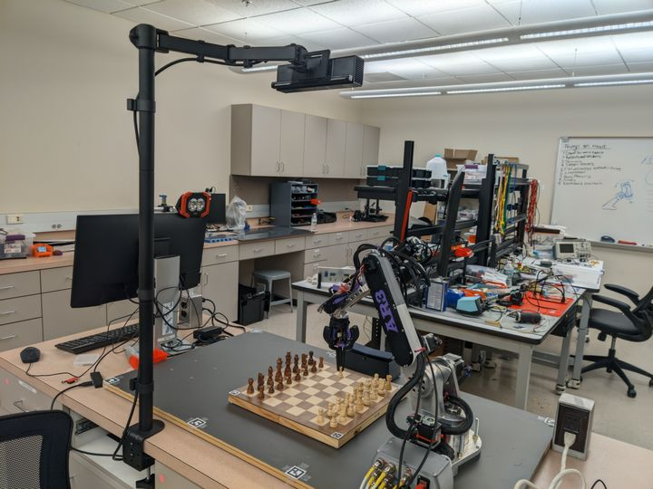
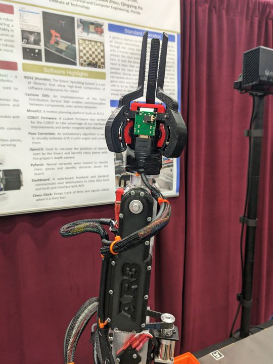
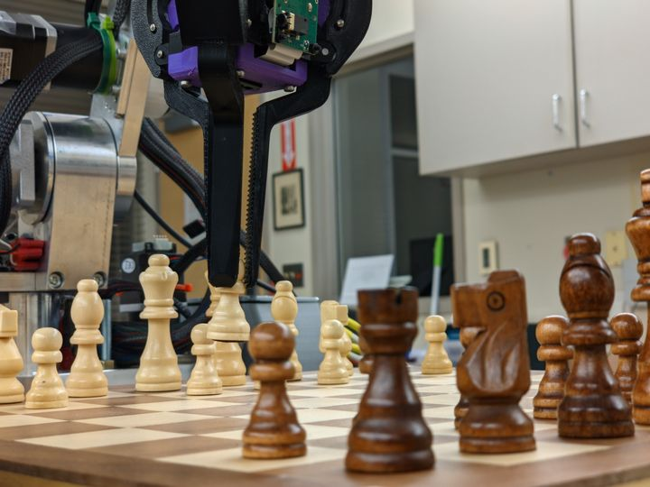
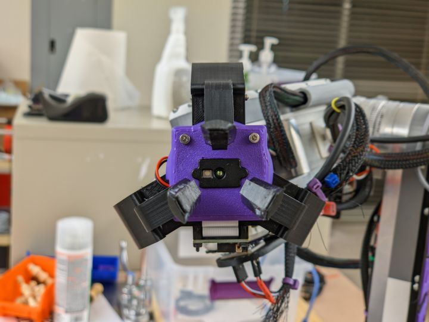
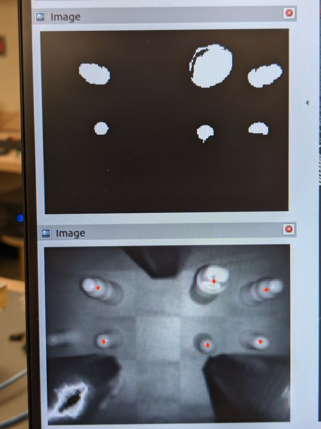
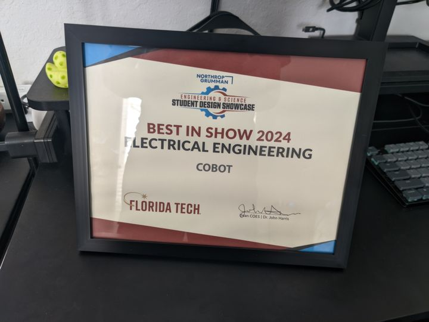
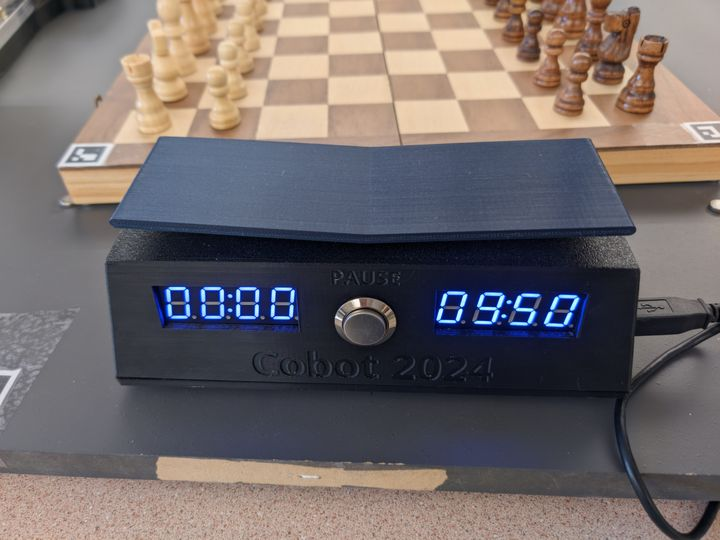
</p>

# SimpleBuffers

SimpleBuffers is a schema language and compiler for data serialization.

A while ago, I noticed that a large part of my time is spent writing code to encode and decode data
for serial communication. This code is predictable, repetitive, and boring to write, so I began
looking for solutions. I've tried out [Protocol Buffers](https://protobuf.dev/),
[FlatBuffers](https://flatbuffers.dev), [Cap'n Proto](https://capnproto.org/), and
[MessagePack](https://msgpack.org/), and I've looked into far more. While many of these projects are
very good, I ran into various issues using them for embedded systems without dynamic memory
allocation, and it proved faster and easier to implement the serialization manually.

Because of this, and because I have lately been interested writing compilers, I decided to implement
my own serialization library. The serialization scheme I designed is explained on the [project's
README](https://github.com/ZachDaChampion/simple-buffers). In short, most data is serialized
sequentially with zero overhead for labels or any other metadata. Decoding can be done lazily, as
the positions of all data is known when the schema is compiled. Variable-length field such as lists
and "OneOfs" are implemented using something akin to a computer's heap; fields are written
sequentially at the end of the statically-sized data, and relative offsets are used as "pointers"
from the static portion to the dynamic.

I didn't know it at the time, but Cap'n Proto uses an almost identical serialization scheme. Their
C++ API is also extremely similar to mine, and they made nearly all of the same decisions and
tradeoffs that I did. This is both extremely validating (the guy who wrote protobuf decided to write
a better version, and he did it the same way that I did!), but also somewhat disappointing, as there
is little reason to use SimpleBuffers over Cap'n Proto. That's okay though; I'm still proud of what
I made and I learned a lot by doing it, especially about compiler design and printing pretty error
messages.

```
// Example SimpleBuffers schema:

enum RobotJoint {
    j0 = 0;
    j1 = 1;
    j2 = 2;
    j3 = 3;
    j4 = 4;
    j5 = 5;
}

sequence Request {
    id: u32;
    enmArray: [RobotJoint];
    payload: oneof {
        init: Init;
        moveTo: MoveTo;
    };
}

sequence Init {
    expected_firmware: u32;
}

sequence MoveTo {
    joints: [MoveToEntry];
}

sequence MoveToEntry {
    joint: RobotJoint;
    angle: f32;
    speed: f32;
}
```

<p>
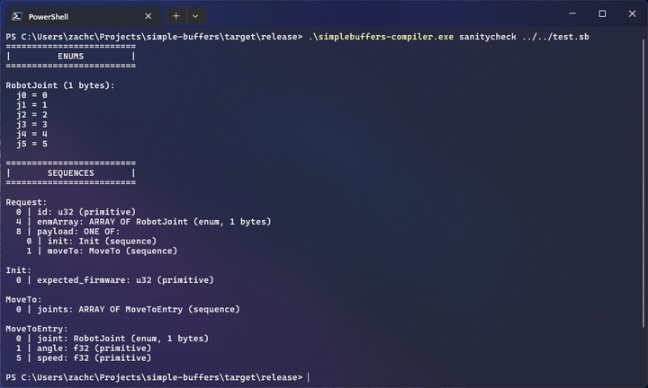
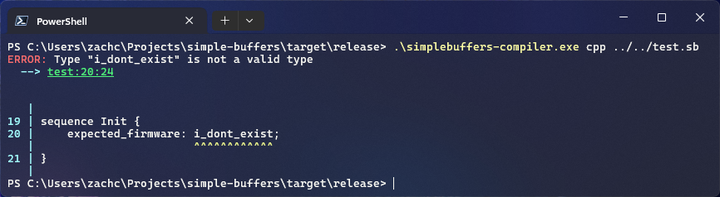
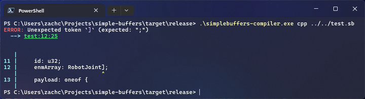
</p>

- View the source code at
  [github.com/ZachDaChampion/simple-buffers](https://github.com/ZachDaChampion/simple-buffers)

# Roomba Experimentation Platform

When working with robotics, I've always been much more enthusiastic about projects that involve
physical robots rather than simulation. For this reason, I developed a platform to put on top of a
Roomba so that I could use it as a robotic base. I started out with a Raspberry Pi and an RPLidar
A2.


I have since acquired an Nvidia Jetson, which is much more powerful than the Raspberry Pi and has a
built-in camera. I redesigned the platform to accommodate the Jetson.

<p>

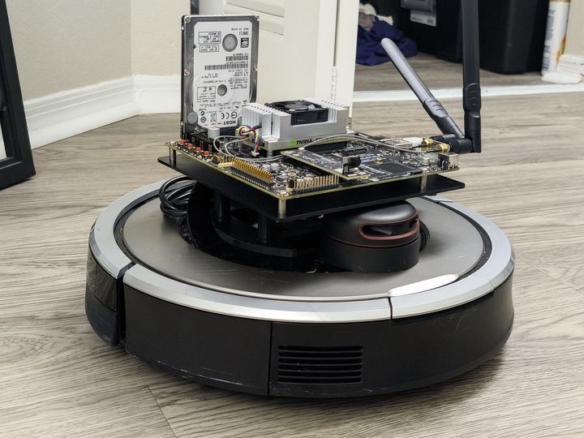
</p>

The system runs ROS2 and has been a lot of fun to use. I have run SLAM, navigation, and autonomous
obstacle avoidance, among other things.

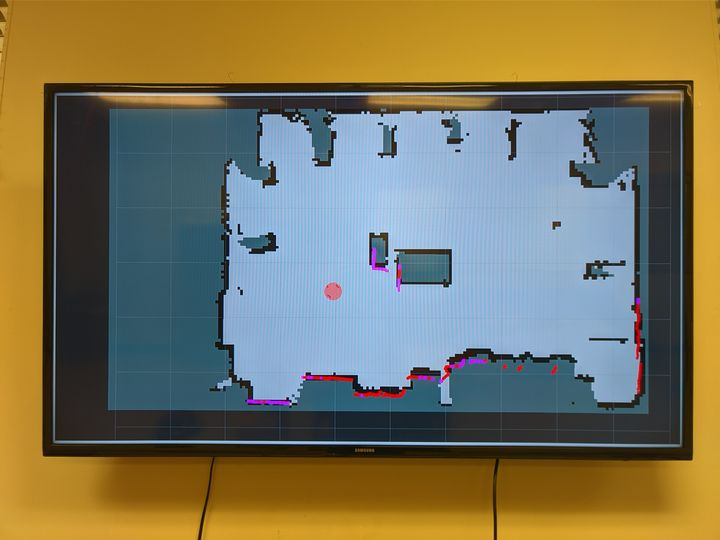

- View (some of) the source code at
  [github.com/ZachDaChampion/Roomba-ROS-Jetson](https://github.com/ZachDaChampion/Roomba-ROS-Jetson)

# Self-Balancing Robot

At first, I built a simple two-wheeled robot that used PID control to balance. This robot used an
Arduino UNO and motors from Vex robotics. While this robot was stable on its own, it was not very
robust against perturbances due to limitations stemming from the motors' maximum speed and the motor
controllers' response time and nonlinearity.

- View the source code at
  [github.com/ZachDaChampion/BalanceBot](https://github.com/ZachDaChampion/BalanceBot)
- See it balancing at [youtu.be/8lDA1xIZCVg](https://youtu.be/8lDA1xIZCVg)

<p>
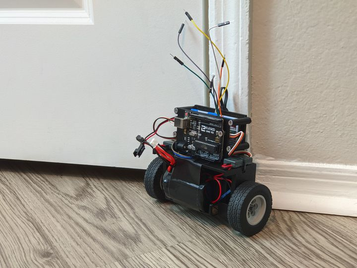
</p>

After some experimenting with belts and geared wheels, I settled on a new design that, in addition
to having a better weight distribution, uses quadrature encoders to measure and correct motor
speeds. I also upgraded to an ESP32 running FreeRTOS coupled with a web-based control dashboard. The
software for this version of the robot is still under development.

<p>
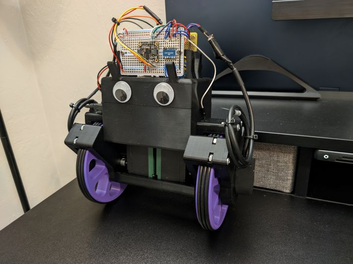
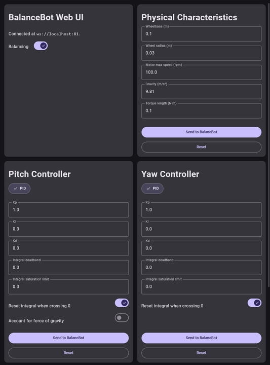
</p>

# Smart Mirror

I disassembled an old laptop and used its internals to create a smart mirror. The mirror runs Linux
and displays a web page that I created. Right now it just shows the date and time, but when I have
more time I plan to add weather, news, and other information.


# Snake World

A genetic algorithm that simulates a population of snakes. Each snake is controlled by a neural
network, and the network is trained by having the snakes compete against each other. The snakes are
given a score based on how long they survive and how many apples they eat. The snakes with the
highest scores are allowed to reproduce, and their neural networks are combined to create the next
generation of snakes. Snakes can die from running into walls or each other's bodies.

This project is implemented in C++ with the QT framework.

- View the source code at
  [github.com/ZachDaChampion/Snake-World](https://github.com/ZachDaChampion/Snake-World)

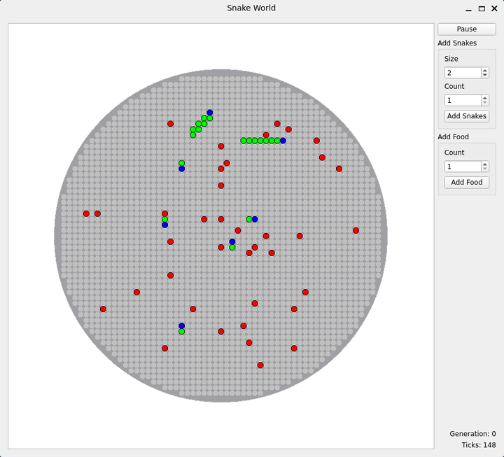

# Search Visualizer

In order to get more comfortable with the QT framework, I created a simple program that visualizes
the A\* and Dijkstra search algorithms. The program allows you to create a weighted grid, add walls,
and select a start and end point. Pathfinding algorithms can be run at varying speeds and the
results can be viewed in real time.

This project is implemented in C++ with the QT framework.

- View the source code and download a release at
  [github.com/ZachDaChampion/Search-Visualizer](https://github.com/ZachDaChampion/Search-Visualizer)

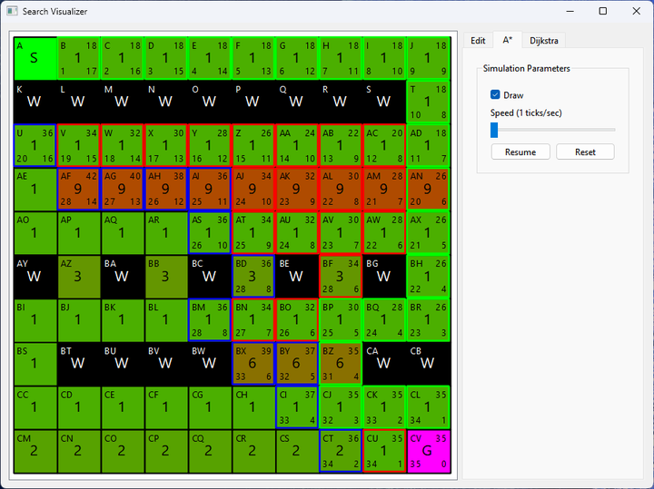

# Quadrature Encoder

I designed and 3d-printed a simple quadrature encoder. It uses two photointerruptors to measure the
rotation of a spinning disk. The disk has a series of slits around its perimeter that the
photointerruptors can detect.

Due to 3d-printing limitations, I could not get very high precision. The disk has 15 slits, giving
it 60 pulses per revolution. The encoder can therefore measure rotations to an accuracy of 1/60th of
a revolution, or 6 degrees. I was unable to get the encoder to count accurately with higher
precision because the slits were too small to be reliably detected.

That being said, the final encoder was perfectly accurate. It accumulated zero error even when
spinning at high speeds.

This encoder was used in a school project in which dynamic band-stop filter was generated and
applied to a live audio signal. The encoder controlled the frequency range of the filter.

<p>


</p>
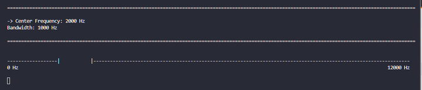

# Rankr

A website for ranking TV episodes. This was my first project done with a modern web framework and I
chose to learn Vue. I primarily used this project to improve my design skills, focusing on making a
good-looking site with natural animations. I also wanted to build my own backend, so I used Node.js
and Express to create a REST API.

- View the source code at [github.com/ZachDaChampion/rankr](https://github.com/ZachDaChampion/rankr)
- Visit the site at [rankr.zachchampion.tech](https://rankr.zachchampion.tech)

<p>


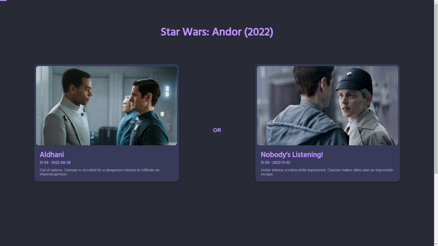
</p>

# Hat Picker

A website for picking a random "card" out of a virtual hat. I originally made this for some friends
who wanted to pick a random movie to watch from a list that we had made. The site allows you to
create multiple hats, each with a different set of cards. You can also configure the hat to select
more than one card at a time to give you a small list of options.

This was my second web project. This time I used Svelte, a framework that compiles to vanilla
JavaScript. I found it much easier to use than Vue. This project is entirely client-side, so I
didn't need to worry about a backend; everything is stored in the browser's local storage.

I did extend this site for a class project, adding a backend with PHP and MySQL to enable live
collaboration between users. However, this version is not currently hosted.

- View the source code at
  [github.com/ZachDaChampion/hat-picker](https://github.com/ZachDaChampion/hat-picker)
- Visit the site at
  [zachdachampion.github.io/hat-picker](https://zachdachampion.github.io/hat-picker/)

<p>
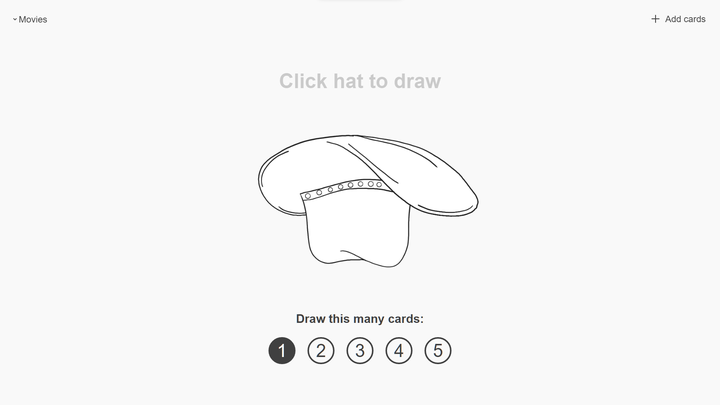

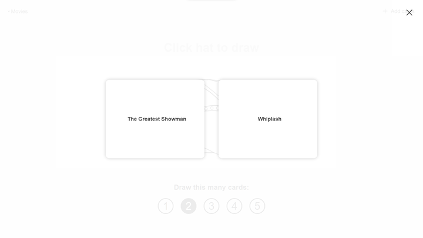
</p>

# Vex Robotics

In high school I participated in Vex Robotics. This is where I first learned C and C++. Most of my
time in high school was spent in robotics, so I have quite a few projects from that time.

## Vex Robot Code

Having been my team's programmer for all four years of high school, I wrote quite a few robot
programs. I've included some of the more notable ones below.

### Worlds 2018

This was the first time that I used PROS, an open-source C(++) framework for Vex robots, rather than
the relatively limited RobotC. This codebase includes PID controllers, automated macros, recording
and playback of actions, and a custom (and very bad) sensor fusion algorithm.

- View the source code at
  [github.com/77788J/77788J-Mark_VII](https://github.com/77788J/77788J-Mark_VII)
- Watch the robot in action
  - Autonomous routine: [https://youtu.be/3ucRSPnvfCc](https://youtu.be/3ucRSPnvfCc)
  - Another autonomous routine: [https://youtu.be/Mr4lmr4Meqw](https://youtu.be/Mr4lmr4Meqw)

### Late 2018

The first robot we built for the 2018-2019 season used a transmission between the chassis and lift
to conserve motors. Controlling both systems simultaneously required carefully tuned control loops
as well as a dynamic priority system to ensure that both subsystems remained stable.

- View the source code at
  [github.com/77788J/77788J-TP-Mark-I](https://github.com/77788J/77788J-TP-Mark-I)

### Early 2019

This code was written for a later robot that did away with the transmission. It included a Pixy
camera that was used to automate intaking balls, aiming the catapult (the game involved shooting
balls at targets), and following objects during the autonomous period.

- View the source code at
  [github.com/77788J/77788J-TP-Mark-II](https://github.com/77788J/77788J-TP-Mark-II)
- Watch the robot in action
  - Autonomous routine:
    [https://youtube.com/shorts/iE0eHTyWHIA](https://youtube.com/shorts/iE0eHTyWHIA)

### Mid-Season Rebuild 2019-2020

With this robot, we bit off much more than we could chew. The robot only lasted for a few weeks
before we reverted to our previous design, so the code did not get much use. It was, however, the
first time I used OkapiLib, a library included with PROS 3 that provided lots of useful
functionality such as PID controllers, odometry, and motion profiling. This robot also had a
transmission, this time between the chassis and the 'tilter'. This transmission was much more
complicated (and, apparently, fragile) than the one used in the previous season, and it required a
more complicated control system. A state machine was needed on top of the PID controllers and
priority system to keep the transmission working properly.

- View the source code at
  [github.com/77788Y/77788Y-Mark-II](https://github.com/77788Y/77788Y-Mark-II)

### States 2020

This code was based on our first robot for the 2019-2020 season, so it does not include OkapiLib. It
instead uses custom PID and motion profiling.

- View the source code at
  [github.com/77788Y/77788Y-Mark-1.5](https://github.com/77788Y/77788Y-Mark-1.5)
- Watch the robot in action
  - Early season "reveal" video: [https://youtu.be/MkmrA7s2rX0](https://youtu.be/MkmrA7s2rX0)
  - Autonomous routine: [https://youtu.be/h7xMGhkN6eA](https://youtu.be/h7xMGhkN6eA)

## ITZ Auto Planner

This was a simple Java program that I wrote to help plan autonomous routines for our robot. It
allowed the user to draw a path on the game field and would provide angles and distances for each
path segment.

- View the source code at
  [github.com/77788J/ITZ-Auto-Planner](https://github.com/77788J/ITZ-Auto-Planner)
- Download the latest release at
  [github.com/77788J/ITZ-Auto-Planner/releases](https://github.com/77788J/ITZ-Auto-Planner/releases)


## Vex Auto Generator

An improvement of "ITZ Auto Planner" from the previous season, this web-based program allowed the
user to draw paths comprised of both lines and arcs. Paths could be saved to a file and loaded
later. They could also be exported as C++ code for use in the robot's autonomous period.

- View the source code at
  [github.com/77788Y/Vex-Auto-Generator](https://github.com/77788Y/Vex-Auto-Generator)

- Visit the site at
  [77788y.github.io/Vex-Auto-Generator/](https://77788y.github.io/Vex-Auto-Generator/)
- 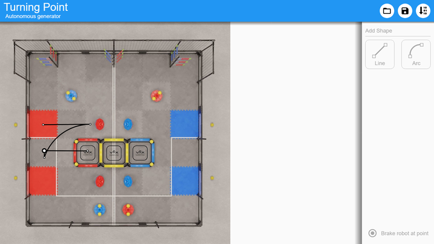
  </details>
