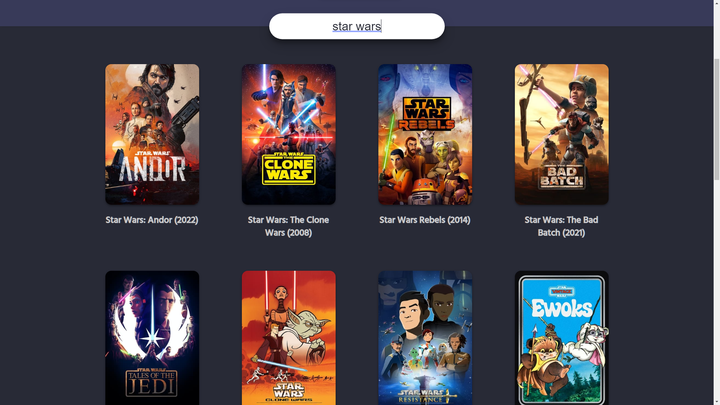
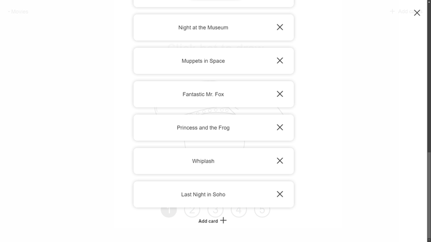

# Hi, I'm Zach
I'm a computer engineering student interested in robotics and embedded programming. I have experience in C, C++, Python, and JavaScript.

# Projects
Here are some highlights of what I've done.

## Rankr
A website for ranking TV episodes. This was my first project done with a modern web framework and I chose to learn Vue.
I primarily used this project to improve my design skills, focusing on making a good-looking site with natural animations.
I also wanted to build my own backend, so I used Node.js and Express to create a REST API.

- View the source code at [github.com/ZachDaChampion/rankr](https://github.com/ZachDaChampion/rankr)
- Visit the site at [rankr.zachchampion.tech](https://rankr.zachchampion.tech)

## Hat Picker
A website for picking a random "card" out of a virtual hat.
I originally made this for some friends who wanted to pick a random movie to watch from a list that we had made.
The site allows you to create multiple hats, each with a different set of cards.
You can also configure the hat to select more than one card at a time to give you a small list of options.

This was my second web project. This time I used Svelte, a framework that compiles to vanilla JavaScript. I found it much easier to use than Vue. This project is entirely client-side, so I didn't need to worry about a backend; everything is stored in the browser's local storage.

I did extend this site for a class project, adding a backend with PHP and MySQL to enable live collaboration between users. However, this version is not currently hosted.

- View the source code at [github.com/ZachDaChampion/hat-picker](https://github.com/ZachDaChampion/hat-picker)
- Visit the site at [zachdachampion.github.io/hat-picker](https://zachdachampion.github.io/hat-picker/)
- 

